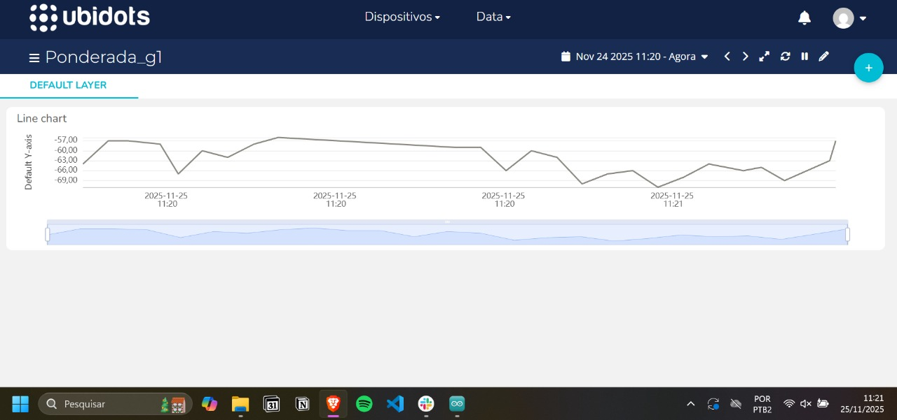
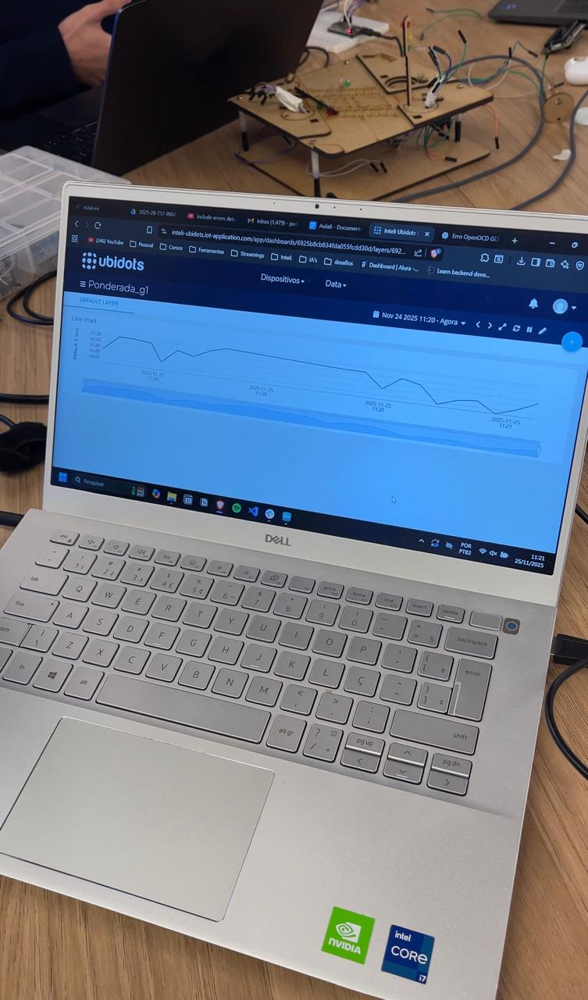
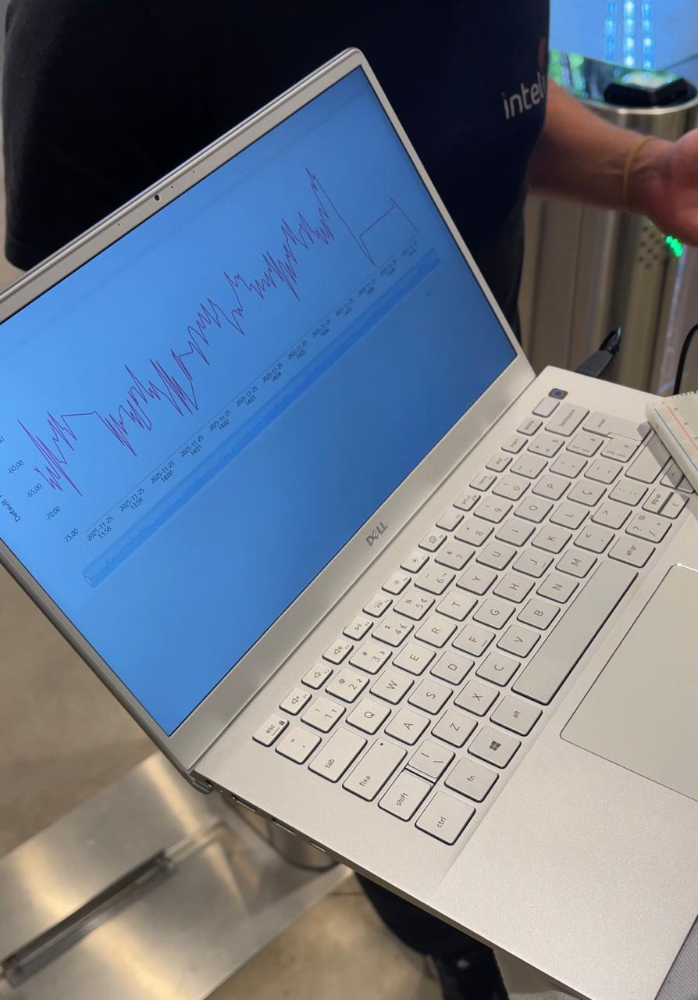
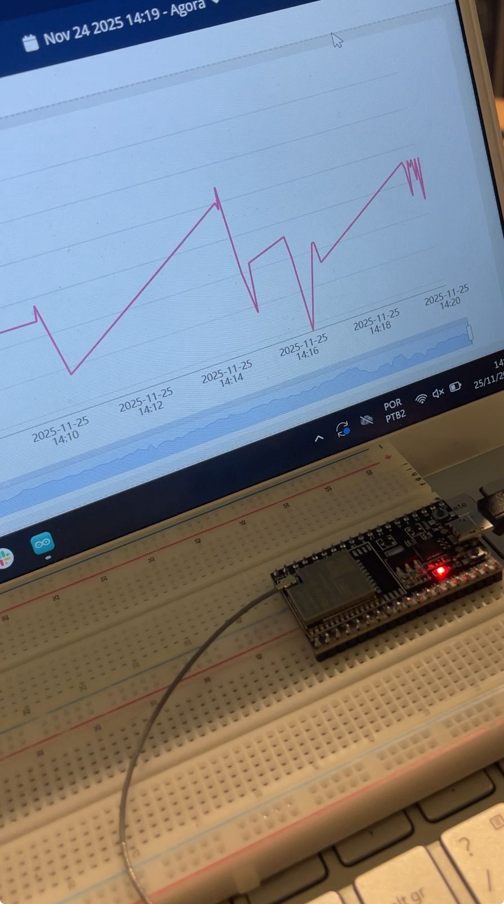
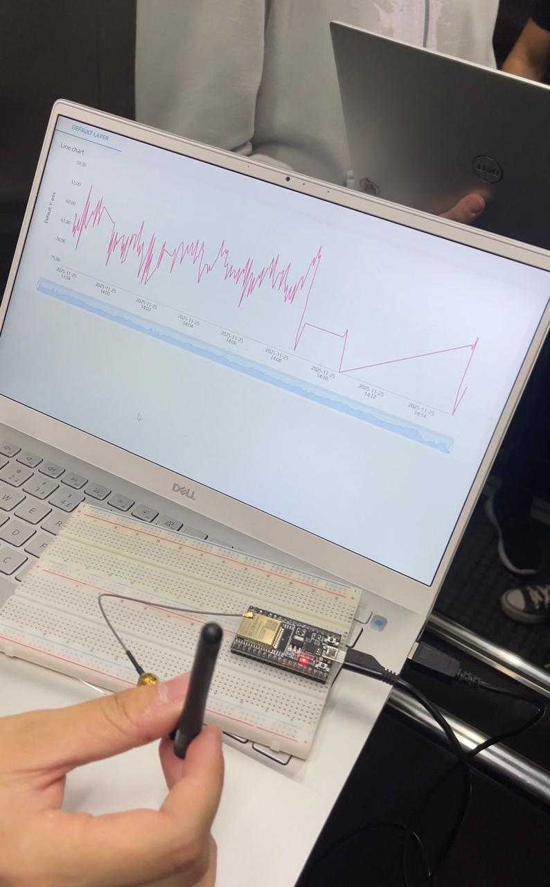
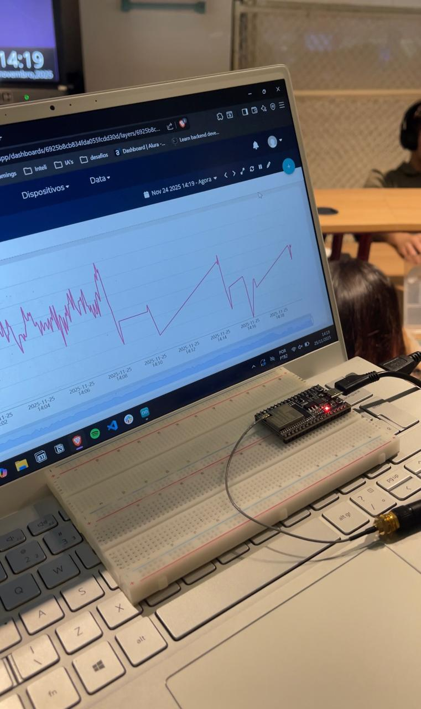
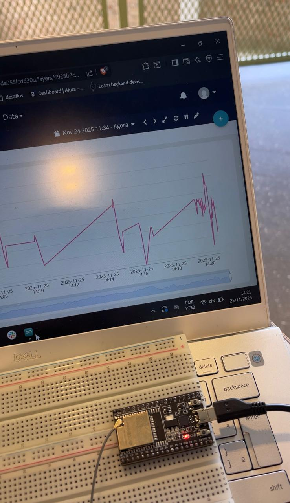
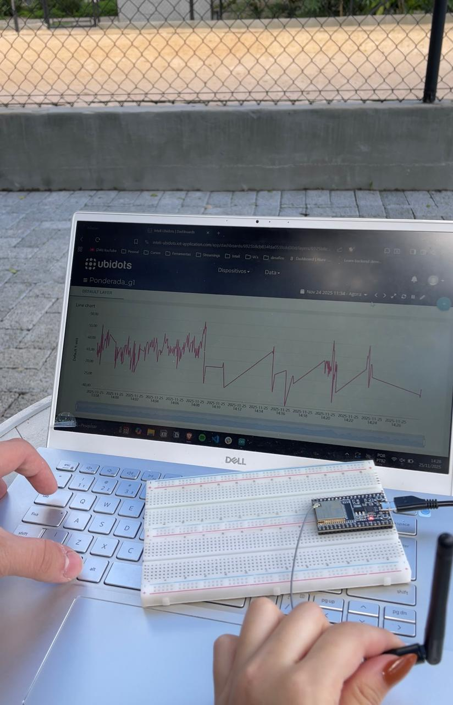

# Atividade Ponderada - Monitoramento de Sinal WiFi com ESP32

## Integrantes do Grupo

<div align="center">
  <table>
    <tr>
      <td align="center">
        <a href="https://www.linkedin.com/in/rayssaguedess/">
          <br>
          <sub><b>Rayssa Guedes</b></sub>
        </a>
      </td>
      <td align="center">
        <a href="https://www.linkedin.com/in/rafael-josue/">
          <br>
          <sub><b>Rafael Josué</b></sub>
        </a>
      </td>
      <td align="center">
        <a href="https://www.linkedin.com/in/pedrosiqueirasouza/">
          <br>
          <sub><b>Pedro Siqueira</b></sub>
  </table>
</div>


## Descrição do Projeto

Este projeto consiste em uma solução IoT para coleta e monitoramento da potência do sinal WiFi em dBm utilizando um ESP32. Os dados coletados são publicados em tempo real através do protocolo MQTT para uma dashboard na plataforma Ubidots, permitindo análise contínua da qualidade do sinal em diferentes ambientes.

## Objetivo

Desenvolver um sistema capaz de:

- Medir a intensidade do sinal WiFi em dBm usando o ESP32
- Publicar os dados coletados via MQTT para a plataforma Ubidots
- Visualizar os dados em um gráfico contínuo (tempo x dBm)
- Demonstrar o efeito da Gaiola de Faraday no bloqueio do sinal WiFi

## Componentes Utilizados

- ESP32
- Rede WiFi (Inteli.Iot)
- Plataforma Ubidots
- Biblioteca UbidotsEsp32Mqtt
- Arduino IDE

## Código Implementado

```cpp
#include "UbidotsEsp32Mqtt.h"

const char *WIFI_SSID = "Inteli.Iot";
const char *WIFI_PASS = "%(Yk(sxGMtvFEs.3";
const char *UBIDOTS_TOKEN = "02939jfajsur37bais83shcas";
const char *DEVICE_LABEL = "esp32_pedro";
const char *VARIABLE_LABEL = "dbm";
const char *CLIENT_ID = "pedropedropedro";

Ubidots ubidots(UBIDOTS_TOKEN, CLIENT_ID);

const int PUBLISH_FREQUENCY = 3000;
unsigned long timer;
unsigned long last_publish = 0;
const unsigned long PUBLISH_INTERVAL = PUBLISH_FREQUENCY;

void callback(char *topic, byte *payload, unsigned int length){
  Serial.print("Message arrived [");
  Serial.print(topic);
  Serial.print("] ");
  for (int i = 0; i < length; i++){
    Serial.print((char)payload[i]);
  }
  Serial.println();
}

float value1;

void setup(){
  Serial.begin(115200);
  ubidots.setDebug(true);
  ubidots.connectToWifi(WIFI_SSID, WIFI_PASS);
  ubidots.setCallback(callback);
  ubidots.setup();
  ubidots.reconnect();
  timer = millis();
}

void loop() {
  if (WiFi.status() == WL_CONNECTED) {
    int32_t dBm = WiFi.RSSI();
    if (millis() - last_publish > PUBLISH_INTERVAL) {
      ubidots.add(VARIABLE_LABEL, dBm);
      ubidots.publish(DEVICE_LABEL);
      Serial.printf("Nível de Sinal Wi-Fi: %d dBm\n", dBm);
      last_publish = millis();
    }
  } else {
    Serial.println("Wi-Fi desconectado! Tentando reconectar...");
    WiFi.begin(WIFI_SSID, WIFI_PASS);
  }
}
```

## Funcionamento do Código

1. O ESP32 conecta-se à rede WiFi configurada
2. A cada 3 segundos, o dispositivo mede o RSSI (Received Signal Strength Indicator) em dBm
3. Os valores são publicados na plataforma Ubidots através do protocolo MQTT
4. Os dados são exibidos no monitor serial da Arduino IDE
5. Em caso de desconexão, o sistema tenta reconectar automaticamente

## Dashboard Ubidots

A dashboard foi configurada com um gráfico contínuo que exibe a variação do sinal WiFi ao longo do tempo.



## Cenários de Teste

### 1. Sala de Aula

Monitoramento inicial do sinal WiFi em ambiente aberto.



### 2. Catraca da Recepção

Medição do sinal próximo à área de recepção com bancada de recepcionistas. Tempo de monitoramento: 10 segundos.



### 3. 1º Andar - IT Bar

Teste do sinal no primeiro andar até o posto do IT Bar. Tempo de monitoramento: 10 segundos.



### 4. 1º Andar - Elevador

Permanência no elevador por 20 segundos com porta fechada para observar degradação do sinal.



### 5. 2º Andar - Laboratório André Leal

Monitoramento do sinal no segundo andar, laboratório do André Leal. Tempo de monitoramento: 10 segundos.



### 6. Final do Mezanino 2

Teste na última salinha de reunião do mezanino 2. Tempo de monitoramento: 10 segundos.



### 7. Elevador - Descida sem Permanência

Descida rápida pelo elevador sem permanecer dentro.

### 8. Saída do Inteli

Travessia pela catraca da recepção até o outro lado da rua, próximo ao lago vazio com lona preta. Tempo de monitoramento: 10 segundos.




## Experimento da Gaiola de Faraday

O teste principal foi realizado no elevador do Inteli, que funciona como uma Gaiola de Faraday. Durante o experimento:

1. O ESP32 foi levado para dentro do elevador
2. Permaneceu por pelo menos 5 segundos com as portas fechadas
3. O sinal WiFi foi significativamente atenuado ou bloqueado
4. Após sair do elevador, o sinal foi restabelecido
5. A dashboard registrou claramente o bloqueio temporário e a recuperação do sinal


## Resultados Observados

Durante os testes, foi possível observar:

- Variação do sinal conforme a distância do ponto de acesso
- Atenuação do sinal em áreas mais distantes
- Bloqueio significativo do sinal dentro do elevador (efeito Gaiola de Faraday)
- Recuperação do sinal após saída do elevador
- Influência de obstáculos físicos na qualidade do sinal

## Vídeo da Demonstração

O vídeo completo da experiência, incluindo todos os cenários testados e o experimento da Gaiola de Faraday, está disponível no link abaixo:

[Link do Vídeo no Google Drive](link_do_video_aqui)

Duração: 3 a 5 minutos

## Conclusão

O projeto demonstrou com sucesso a capacidade de monitorar em tempo real a qualidade do sinal WiFi em diferentes ambientes. O experimento da Gaiola de Faraday evidenciou como estruturas metálicas podem bloquear sinais de radiofrequência, comprovando o princípio físico através de dados mensuráveis visualizados na dashboard do Ubidots.

--- 
<p align="center">
Feito com 🩷 Prof! 
</p>


